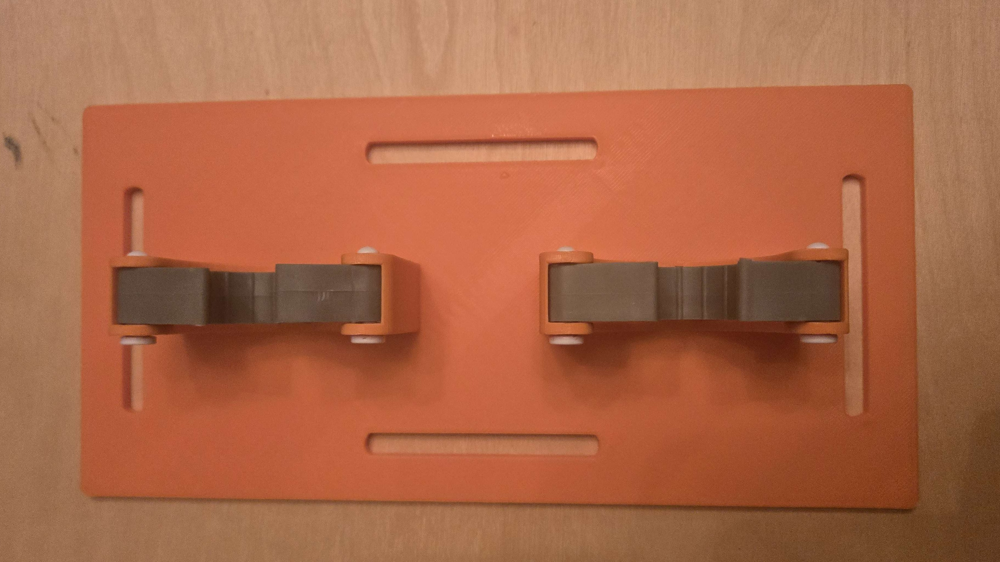
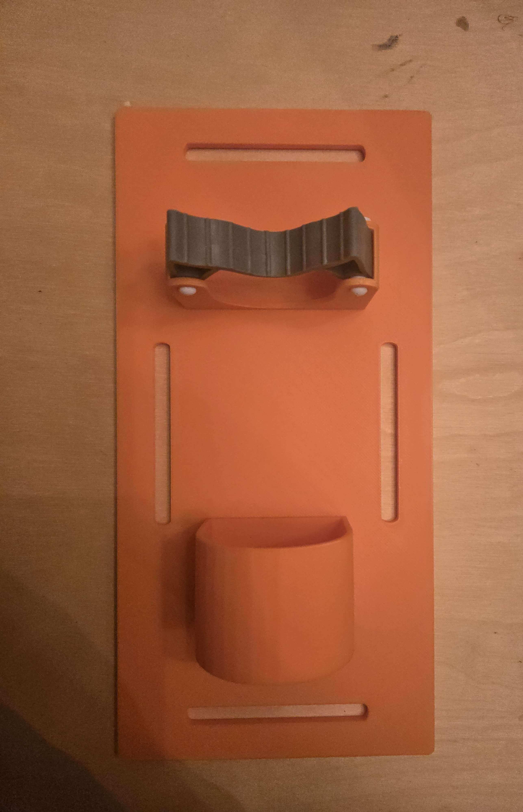

# Overview

A wheelchair-mounted crutch holder designed to keep crutches secure and within reach

<figure><figcaption></figcaption></figure>

<figure><figcaption></figcaption></figure>

This contains:

* 3D printable STL files
* Printing instructions
* Required Hardware
* Assembly instructions
